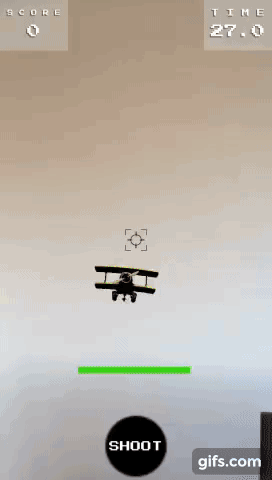

# Description
AR shooting game using AR Foundation in Unity.

# Issues/Solutions
Used a 'preload' scene to instantiate managers/controllers.
This was required to account for the AR Session component that needed to be in every scene but could not persist through scene reloads.

# Gameplay

# Unity version
2019.1.2f1
